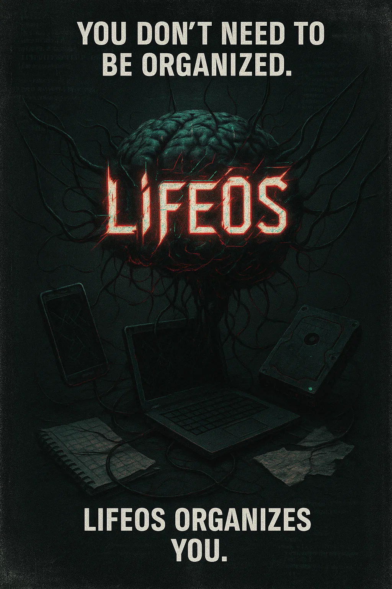

# 🛡️ LifeOS Free

<div align="center">
  
</div>

> **نظام إدارة الحياة الرقمية الآمن**

[](https://opensource.org/licenses/MIT)
[](https://developer.mozilla.org/en-US/docs/Web/JavaScript)
[](https://developer.mozilla.org/en-US/docs/Web/HTML)
[](https://developer.mozilla.org/en-US/docs/Web/CSS)

**LifeOS Free** هو نظام قوي وآمن ومركز على الخصوصية لإدارة الحياة الرقمية. أدر كلمات المرور وجهات الاتصال والمفضلات مع تشفير عسكري - كل شيء يعمل محلياً في متصفحك بدون إرسال أي بيانات لخوادم خارجية.

## 🌟 الميزات الرئيسية

### 🔐 **مدير كلمات المرور**
- **تشفير AES-256** مع اشتقاق المفاتيح PBKDF2
- **تصنيف ذكي** بالتاجات المخصصة
- **نسخ بنقرة واحدة** لأسماء المستخدمين وكلمات المرور
- **مولد كلمات مرور آمن** (قادم في النسخة المدفوعة)
- **استيراد/تصدير JSON** لنقل البيانات

### 👥 **إدارة جهات الاتصال**
- **تخزين شامل للجهات** مع حقول متعددة
- **بحث وتصفية ذكي** عبر جميع بيانات الاتصال
- **تنظيم بالفئات** للجهات الشخصية والمهنية
- **دعم استيراد CSV** للنقل السهل

### 🔖 **مدير المفضلات**
- **تخزين منظم للروابط** مع أوصاف وفئات
- **وصول سريع** مع فتح بنقرة واحدة في تبويب جديد
- **استيراد HTML/JSON** من مديري المفضلات الأخرى
- **تصنيف ذكي** لتنظيم أفضل

### 🎨 **واجهة عصرية**
- **تصميم متجاوب** محسن للحاسوب والهاتف
- **تبديل الثيم** المظلم/الفاتح
- **فلاتر قابلة للطي** لاستغلال أفضل للمساحة
- **تنقل محسن للهاتف** مع قائمة هامبرغر
- **دعم متعدد اللغات** (عربي/إنجليزي)

## 🔒 الأمان والخصوصية

| الميزة | الوصف |
|--------|-------|
| **🔐 تشفير محلي** | جميع البيانات مشفرة بـ AES-256 + PBKDF2 |
| **🚫 عدم جمع البيانات** | لا توجد تحليلات أو تتبع أو إرسال بيانات |
| **💻 عمل بدون إنترنت** | يعمل بالكامل بدون إنترنت بعد التحميل الأولي |
| **🔍 مفتوح المصدر** | شفافية كاملة للكود لمراجعة الأمان |
| **🛡️ كلمة مرور رئيسية** | كلمة مرور واحدة تحمي جميع بياناتك |

## 🚀 البدء السريع

### الخيار 1: التحميل المباشر
1. **حمل** أحدث إصدار
2. **استخرج** الملفات للمكان المفضل
3. **افتح** `index.html` في متصفحك
4. **اضبط** كلمة المرور الرئيسية
5. **ابدأ** إدارة حياتك الرقمية!

### الخيار 2: استنساخ المستودع
```bash
git clone https://github.com/yourusername/lifeos-free.git
cd lifeos-free
# افتح index.html في متصفحك
```

## 📱 الاستخدام على الهاتف

LifeOS Free محسن بالكامل للأجهزة المحمولة:

- **📱 تصميم متجاوب**: يتكيف مع أي حجم شاشة
- **☰ قائمة الهاتف**: تنقل سهل مع قائمة هامبرغر
- **👆 محسن للمس**: جميع التفاعلات مصممة للمس
- **🔍 فلاتر قابلة للطي**: اضغط "التصنيفات" لإظهار/إخفاء الفلاتر

## 🛠️ المكدس التقني

| التقنية | الغرض |
|---------|-------|
| **HTML5** | البنية والعلامات الدلالية |
| **CSS3** | التصميم العصري مع CSS Grid/Flexbox |
| **JavaScript خالص** | الوظائف الأساسية (ES6+) |
| **Web Crypto API** | التشفير من جانب العميل |
| **Local Storage** | استمرارية البيانات الآمنة |
| **Font Awesome** | أيقونات جميلة |
| **IBM Plex Sans** | خطوط احترافية |

## 📋 متطلبات النظام

- **المتصفح**: Chrome 60+, Firefox 55+, Safari 11+, Edge 79+
- **JavaScript**: يجب أن يكون مفعلاً
- **التخزين**: ~5MB مساحة تخزين محلية
- **الإنترنت**: مطلوب فقط لتحميل الخطوط/الأيقونات الأولي

## 🌍 دعم اللغات

- **🇸🇦 العربية** (`index.html`) - دعم كامل للكتابة من اليمين لليسار
- **🇺🇸 الإنجليزية** (`index-en.html`) - ترجمة كاملة
- **🔄 تبديل سهل** - زر تبديل اللغة

## 🤝 المساهمة

نرحب بمساهمات المجتمع! إليك كيف يمكنك المساعدة:

### 🐛 تقارير الأخطاء
- استخدم GitHub Issues للإبلاغ عن الأخطاء
- اذكر إصدار المتصفح وخطوات إعادة الإنتاج
- لقطات الشاشة مفيدة!

### 💡 طلبات الميزات
- تحقق من المشاكل الموجودة أولاً
- اوصف حالة الاستخدام والسلوك المتوقع
- فكر في التأثير على الأمان والخصوصية

### 🔧 مساهمات الكود
- انسخ المستودع (Fork)
- أنشئ فرع ميزة
- اتبع نمط الكود الموجود
- اختبر بدقة قبل إرسال PR

### 🌐 الترجمات
- ساعد في الترجمة لمزيد من اللغات
- اتبع بنية الترجمة الموجودة
- اختبر تخطيط الواجهة مع اللغة الجديدة

## 📊 حالة المشروع

| المكون | الحالة | ملاحظات |
|--------|-------|---------|
| **النظام الأساسي** | ✅ مكتمل | مستقر وآمن |
| **مدير كلمات المرور** | ✅ مكتمل | مجموعة ميزات كاملة |
| **مدير جهات الاتصال** | ✅ مكتمل | دعم استيراد CSV |
| **مدير المفضلات** | ✅ مكتمل | استيراد HTML/JSON |
| **واجهة الهاتف** | ✅ مكتمل | متجاوب بالكامل |
| **النسخة الإنجليزية** | ✅ مكتمل | ترجمة كاملة |
| **التوثيق** | ✅ مكتمل | أدلة شاملة |

## 🔮 خارطة الطريق

### 🎯 الميزات القادمة
- **🔐 مولد كلمات مرور متقدم** مع قواعد قابلة للتخصيص
- **📱 دعم تطبيق الويب التقدمي** (PWA)
- **🔄 مزامنة سحابية آمنة** (اختيارية، مشفرة)
- **📊 لوحة أمان** مع مراقبة الاختراقات
- **🎨 ثيمات مخصصة** وخيارات التخصيص

### 🚀 الإصدارات المستقبلية
- **تطبيق سطح المكتب** (مبني على Electron)
- **تطبيقات الهاتف** (iOS/Android)
- **إضافات المتصفح** للملء التلقائي
- **ميزات الفريق** للخزائن المشتركة

## ⚠️ ملاحظات أمان مهمة

> **🔑 كلمة المرور الرئيسية**: كلمة المرور الرئيسية هي مفتاح جميع بياناتك. إذا فقدتها، لا يمكن استرداد بياناتك. احفظها بأمان!

> **💾 النسخ الاحتياطية**: صدر بياناتك بانتظام من قسم الأدوات. احفظ النسخ الاحتياطية في أماكن آمنة متعددة.

> **🔒 أمان المتصفح**: استخدم متصفحاً حديثاً ومحدثاً. فكر في استخدام ملف تعريف متصفح مخصص للبيانات الحساسة.

## 📄 الترخيص

هذا المشروع مرخص تحت **رخصة MIT** - راجع ملف [LICENSE](LICENSE) للتفاصيل.

## 🙏 الشكر والتقدير

- **Font Awesome** للأيقونات الجميلة
- **IBM Plex Sans** للخطوط الممتازة
- **Web Crypto API** للتشفير الآمن من جانب العميل
- **مجتمع المصدر المفتوح** للإلهام والتغذية الراجعة

## 📞 الدعم والتواصل

- **🐛 تقارير الأخطاء**: [GitHub Issues](https://github.com/yourusername/lifeos-free/issues)
- **💬 المناقشات**: [GitHub Discussions](https://github.com/yourusername/lifeos-free/discussions)
- **📧 البريد الإلكتروني**: معلومات التواصل ستكون متاحة قريباً
- **📖 التوثيق**: نظام مساعدة مدمج متاح في التطبيق

---

<div align="center">

**صُنع بـ ❤️ من أجل الخصوصية والأمان الرقمي**

[⭐ قيم هذا المشروع](https://github.com/yourusername/lifeos-free) • [🍴 انسخه](https://github.com/yourusername/lifeos-free/fork) • [📝 ساهم](CONTRIBUTING.md)

</div>