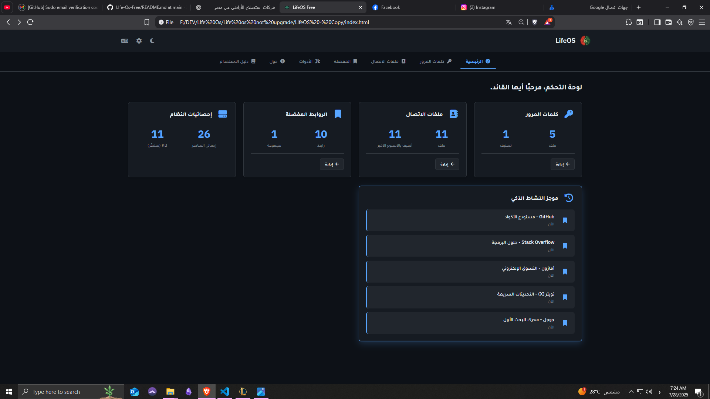
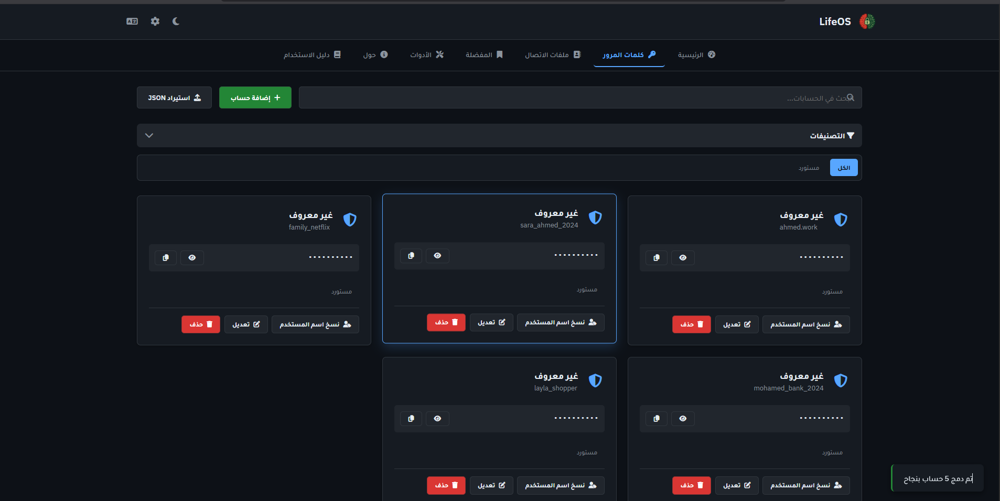
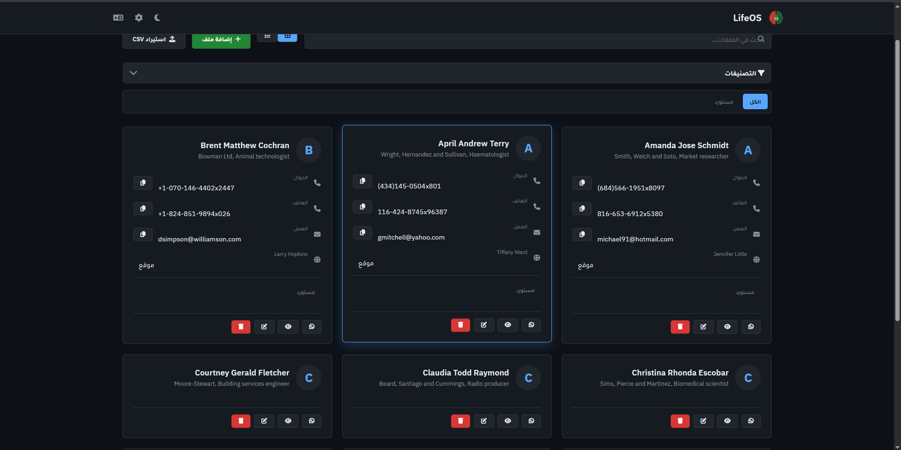
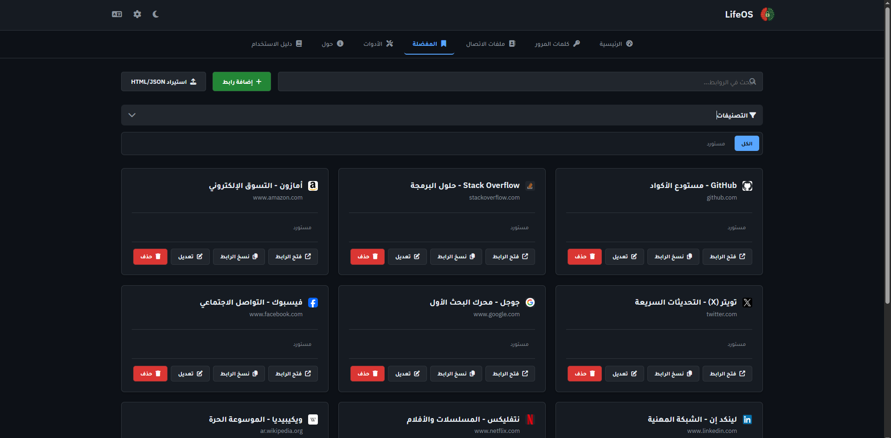
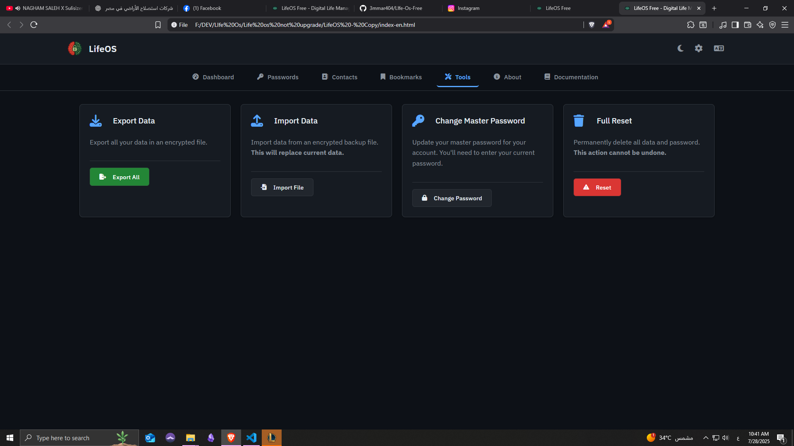
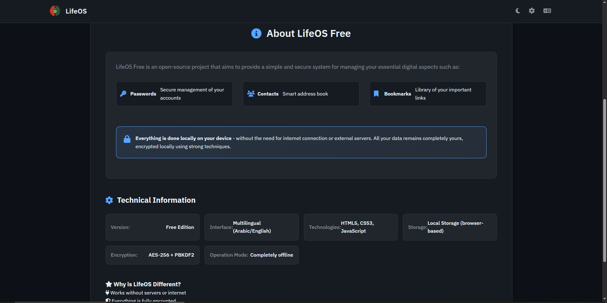

# 🛡️ LifeOS Free

<div align="center">
  
</div>

> **Secure Digital Life Management System**

[](https://opensource.org/licenses/MIT)
[](https://developer.mozilla.org/en-US/docs/Web/JavaScript)
[](https://developer.mozilla.org/en-US/docs/Web/HTML)
[](https://developer.mozilla.org/en-US/docs/Web/CSS)

**LifeOS Free** is a powerful, secure, and privacy-focused digital life management system. Manage your passwords, contacts, and bookmarks with military-grade encryption - all running locally in your browser with zero data transmission to external servers.

## 🌟 Key Features

### 🔐 **Password Manager**
- **AES-256 Encryption** with PBKDF2 key derivation
- **Smart Categorization** with custom tags
- **One-click Copy** for usernames and passwords
- **Secure Password Generator** (coming in Pro version)
- **JSON Import/Export** for data migration

### 👥 **Contact Management**
- **Comprehensive Contact Storage** with multiple fields
- **Smart Search & Filtering** across all contact data
- **Category Organization** for personal and professional contacts
- **CSV Import Support** for easy migration

### 🔖 **Bookmark Manager**
- **Organized Link Storage** with descriptions and categories
- **Quick Access** with one-click opening in new tabs
- **HTML/JSON Import** from other bookmark managers
- **Smart Categorization** for better organization

### 🎨 **Modern Interface**
- **Responsive Design** optimized for desktop and mobile
- **Dark/Light Theme** toggle
- **Collapsible Filters** for better space utilization
- **Mobile-First Navigation** with hamburger menu
- **Multilingual Support** (Arabic/English)

## 🔒 Security & Privacy

| Feature | Description |
|---------|-------------|
| **🔐 Local Encryption** | All data encrypted with AES-256 + PBKDF2 |
| **🚫 Zero Data Collection** | No analytics, tracking, or data transmission |
| **💻 Offline Operation** | Works completely offline after initial load |
| **🔍 Open Source** | Full code transparency for security auditing |
| **🛡️ Master Password** | Single password protects all your data |

## 🚀 Quick Start

### Option 1: Direct Download
1. **Download** the latest release
2. **Extract** files to your preferred location
3. **Open** `index.html` in your browser
4. **Set** your master password
5. **Start** managing your digital life!

### Option 2: Clone Repository
```bash
git clone https://github.com/yourusername/lifeos-free.git
cd lifeos-free
# Open index.html in your browser
```

## 📱 Mobile Usage

LifeOS Free is fully optimized for mobile devices:

- **📱 Responsive Design**: Adapts to any screen size
- **☰ Mobile Menu**: Easy navigation with hamburger menu
- **👆 Touch Optimized**: All interactions designed for touch
- **🔍 Collapsible Filters**: Tap "Categories" to show/hide filters

## 📸 Screenshots

### 🏠 Home Dashboard


### 🔐 Password Management


### 👥 Contact Management


### 🔖 Bookmark Management


### ⚙️ Settings & Tools


### 📖 Documentation


## 🛠️ Technical Stack

| Technology | Purpose |
|------------|---------|
| **HTML5** | Semantic markup and structure |
| **CSS3** | Modern styling with CSS Grid/Flexbox |
| **Vanilla JavaScript** | Core functionality (ES6+) |
| **Web Crypto API** | Client-side encryption |
| **Local Storage** | Secure data persistence |
| **Font Awesome** | Beautiful icons |
| **IBM Plex Sans** | Professional typography |

## 📋 System Requirements

- **Browser**: Chrome 60+, Firefox 55+, Safari 11+, Edge 79+
- **JavaScript**: Must be enabled
- **Storage**: ~5MB local storage space
- **Internet**: Only required for initial font/icon loading

## 🌍 Language Support

- **🇸🇦 Arabic** (`index.html`) - Full RTL support
- **🇺🇸 English** (`index-en.html`) - Complete translation
- **🔄 Easy Switching** - Language toggle button

## 🤝 Contributing

We welcome contributions from the community! Here's how you can help:

### 🐛 Bug Reports
- Use GitHub Issues to report bugs
- Include browser version and steps to reproduce
- Screenshots are helpful!

### 💡 Feature Requests
- Check existing issues first
- Describe the use case and expected behavior
- Consider the impact on security and privacy

### 🔧 Code Contributions
- Fork the repository
- Create a feature branch
- Follow existing code style
- Test thoroughly before submitting PR

### 🌐 Translations
- Help translate to more languages
- Follow the existing translation structure
- Test UI layout with new language

## 📊 Project Status

| Component | Status | Notes |
|-----------|--------|-------|
| **Core System** | ✅ Complete | Stable and secure |
| **Password Manager** | ✅ Complete | Full feature set |
| **Contact Manager** | ✅ Complete | CSV import supported |
| **Bookmark Manager** | ✅ Complete | HTML/JSON import |
| **Mobile Interface** | ✅ Complete | Fully responsive |
| **English Version** | ✅ Complete | Full translation |
| **Documentation** | ✅ Complete | Comprehensive guides |

## 🔮 Roadmap

### 🎯 Upcoming Features
- **🔐 Advanced Password Generator** with customizable rules
- **📱 Progressive Web App** (PWA) support
- **🔄 Secure Cloud Sync** (optional, encrypted)
- **📊 Security Dashboard** with breach monitoring
- **🎨 Custom Themes** and personalization options

### 🚀 Future Versions
- **Desktop App** (Electron-based)
- **Mobile Apps** (iOS/Android)
- **Browser Extensions** for auto-fill
- **Team Features** for shared vaults

## ⚠️ Important Security Notes

> **🔑 Master Password**: Your master password is the key to all your data. If you lose it, your data cannot be recovered. Store it securely!

> **💾 Backups**: Regularly export your data from the Tools section. Store backups in multiple secure locations.

> **🔒 Browser Security**: Use a modern, updated browser. Consider using a dedicated browser profile for sensitive data.

## 📄 License

This project is licensed under the **MIT License** - see the [LICENSE](LICENSE) file for details.

## 🙏 Acknowledgments

- **Font Awesome** for beautiful icons
- **IBM Plex Sans** for excellent typography
- **Web Crypto API** for secure client-side encryption
- **Open Source Community** for inspiration and feedback

## 📞 Support & Contact

- **🐛 Bug Reports**: [GitHub Issues](https://github.com/yourusername/lifeos-free/issues)
- **💬 Discussions**: [GitHub Discussions](https://github.com/yourusername/lifeos-free/discussions)
- **📧 Email**: Contact information will be available soon
- **📖 Documentation**: Built-in help system available in the app

---

<div align="center">

**Made with ❤️ for digital privacy and security**

[⭐ Star this project](https://github.com/3mmar404/lifeos-free) •
 [🍴 Fork it](https://github.com/3mmar404/lifeos-free/fork) • 
 [📝 Contribute](CONTRIBUTING.md)

</div>